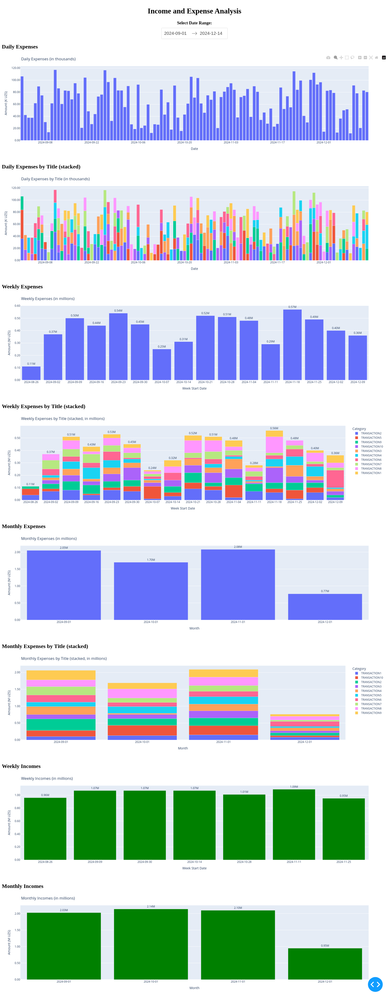

# App for Analyzing Expenses and Incomes

This application analyzes expenses and incomes based on data exported from the Click web application.

This is a web application built using **Python** and the following libraries:

- **Dash**: For building the interactive web application.
- **pandas**: For data manipulation and analysis.
- **Plotly**: For creating interactive visualizations.

## Instructions

For instructions, please refer to the [instruction.odt](instruction.odt) file (russian language)

## Example

Below is an example screenshot of the application:

